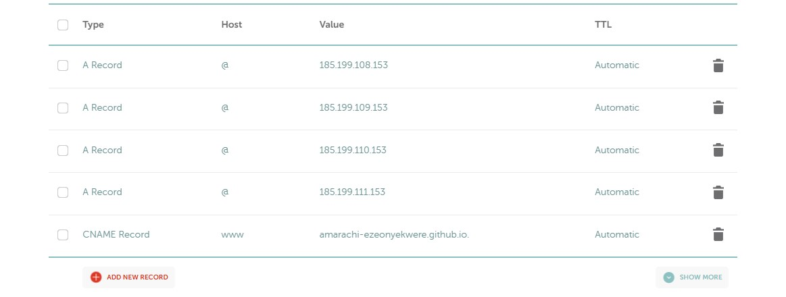
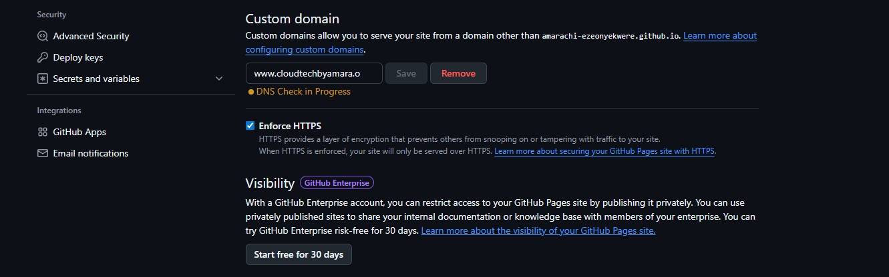

#  Cloud & DevOps Portfolio Website with Integrated Chatbot 

This project is my **personal portfolio website**, built to showcase **Cloud Engineering, DevOps, and Automation skills**. It is a static website with integrated chatbot, depoloyed on Github pages with custom domain setup (Namecheap).

Beyond being a portfolio, the site is designed to **demonstrate how digital solutions can improve visibility, communication, and trust** in technical work.  

Check Out The **Live website** here [view website](https://www.cloudtechbyamara.online/)

---

##  Business Relevance  

- **Problem: Recruiters and teams often struggle to quickly understand what a candidate can deliver.**

  🔹 *Solution:* I created a **chatbot-driven portfolio** that provides instant, structured answers about my projects (e.g., monitoring, automation, cloud infra, linux).  
  → This demonstrates how automation improves **self-service information sharing** (a concept used in customer support portals and internal engineering knowledge bases).  

- **Problem: Hiring Managaers and Recruiters want proof of hands-on work, not just words.** 

  🔹 *Solution:* I added a **screenshot gallery** that visually documents project steps and results.  
  →  This mirrors how engineering teams use **dashboards and evidence-based reporting** to communicate results in business.  

- **Problem: Updating technical content often requires complex pipelines and incures cost.**  

  🔹 *Solution:* I deployed my website on **GitHub Pages**, where any code push automatically reflects online.  
  → This shows how Git-based workflows enable **continuous delivery of documentation and apps** with low overhead.  
 

---

##  Features  

- **Chatbot Assistant**  
  Helps visitors navigate projects and find information instantly.  
  Mimics **self-service support bots** used in SaaS and IT operations.  

- **Screenshot Gallery**  
  Provides transparent, step-by-step evidence of projects.  
  Similar to how **compliance and IT teams use evidence reports**.  

- **Responsive Design**  
  Works across devices important for **user-facing apps**.  

- **GitHub Pages Deployment**  
  Zero-cost hosting with **built-in CI/CD pipeline** (Git push = live update).  


---

##  How I achieved this with Screenshots

1. Pushed code base to my Github and enabled Git pages for hosting and continuous deployment.


2. For Domain name customization and integration, I added an A-record and a CNAME record on NameCheap


3. After the domain name is propagated, I enforced traffic encryption with the HTTPS for secure access.


4. My page website is live and interactive.


5. Webpage-Front View


6. Webpage-Back View


---

##  Tech Stack

- Frontend: HTML5, CSS3, JavaScript

- Chatbot Integration: Embedded via JavaScript & API (custom integration)

- Hosting: GitHub Pages (static hosting)

- Domain Management: Namecheap (custom domain + DNS configuration)

- Version Control: Git & GitHub (commit history, branching, repo management)

---

##  Setup & Deployment  

### 1. Clone the Repository  
```bash
git clone https://github.com/<Amarachi-Ezeonyekwere>/<chatbot-website-deployemnt>.git
```
### 2. Navigate into the project
```bash
cd <chatbot-website-deployment>
```
### 3. Run Locally
Open `index.html` in your browser.

### 4. Deploy on GitHub Pages

* Push changes:

  ```bash
  git add .
  git commit -m "Initial portfolio commit"
  git push origin main
  ```
* Go to **Settings → Pages → Select branch `main`**
* Site goes live at:
  `https://<your-username>.github.io/<your-repo>/`
* At this point you integrate a domain name from any DNS provider, add reacords and in few hours your url will be customised to your domain name.

---

##  Updating the Website

Every `git push` = automatic live update on GitHub Pages.
This mirrors how businesses use **continuous deployment** to ship features faster.

---

##  Codebase Location
The main website code is stored in the **`master`** branch.  

[view the codebase](https://github.com/Amarachi-Ezeonyekwere/chatbot-website-deployement/tree/master)

⚠️ Important: If you are forking this project to work with the code,  
please switch to the **`master` branch** with `git checkout master`

The branch (`docs`) is for project documentation, explanations, and supporting files.


---
## License
This project is licensed under the MIT License - see the [LICENSE](./LICENSE) file for details.

---

*Kindly note: This project is iterative and ongoing,Thank you for reading!*